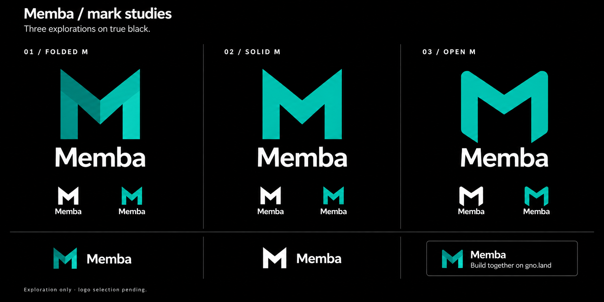

# Separate branding exploration — M on black

Status: exploration requested; no logo replacement approved.

| Study | Character | Tradeoff |
|---|---|---|
| 01 · Folded M | Closest to the original concept the user liked; angular geometry with teal facets. | Facets add identity at large sizes but can disappear at small sizes. |
| 02 · Solid M | A simpler silhouette suited to compact UI, monochrome and favicon exploration. | Less distinctive surface treatment; needs careful spacing and proportions. |
| 03 · Open M | Softer corners and more open structure, potentially more approachable. | Less close to the originally liked mark; must remain recognizably an M. |

**Recommendation to discuss:** develop 01 as the expressive brand mark and investigate a matching one-color silhouette based on 02 for compact use. The two should share one consistent geometry if selected; they should not become unrelated logos. Keep 03 as an alternative rather than mixing its corners into the first design by default.

The black field strengthens the teal/white contrast and gives the mark a clear silhouette. The social preview demonstrates a potential composition only; “Build together on gno.land” is proposed copy, not a confirmed tagline.

## Before a logo could be adopted

Redraw the chosen concept as editable vector artwork with consistent geometry. Test true 16/24/32 px rasterizations, monochrome, light background, pure-black background, favicon and maskable crops, social preview, wordmark spacing and clear space. The small specimens in this board are visual exploration, not actual-size legibility tests. Also review distinctiveness and similarity before adoption; this study makes no trademark-clearance claim.

The generated “solid” specimen contains subtle tonal variation and some small examples vary geometrically. A production solid mark must be a single fill, and every size must derive from the approved geometry with documented optical adjustments. No gradient, tile or color treatment should be inferred as required from a generated raster.

The board was created using the built-in image tool with the original direction board as the reference. Prompts are retained in [PROMPTS-ROUND-2.md](PROMPTS-ROUND-2.md). It is a design asset in this study only; production logo/icon/OG files remain untouched.
