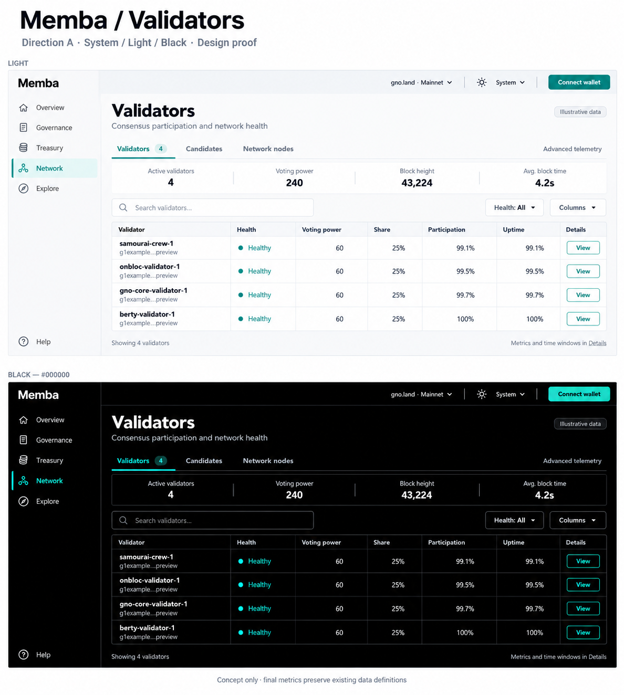
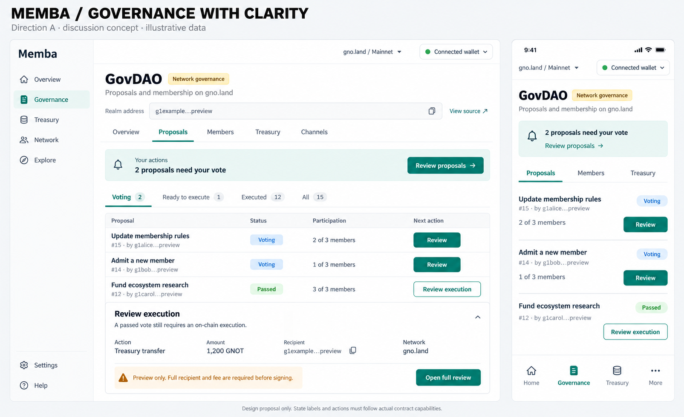

# Memba: professional mainnet design study

**14 September 2026 · Round 2 · Direction confirmed; detailed proof and implementation plan proposed**

Memba has substantial functionality, but its presentation still asks users to interpret a developer-oriented ecosystem dashboard. The strongest opportunity is to make everyday governance and treasury work immediately understandable, while preserving technical depth and truthful network status.

**Confirmed direction:** A, Quiet Confidence, for DAO/treasury teams, mainstream communities and entrepreneurs/companies building on gno.land. Follow the system theme by default, with true `#000000` Black instead of B's charcoal/slate palette. Simplified navigation is accepted in principle. Validators is the first design proof; branding is explored separately.

## Current round

1. [Confirmed decisions and remaining choices](DECISIONS.md)
2. [Validators: Light and true Black proof](VALIDATORS-PROOF.md)
3. [Separate M branding exploration](BRANDING.md)
4. [Implementation-plan proposal](IMPLEMENTATION-PLAN.md)

## Initial audit and historical proposals

1. [Audit: findings and coverage of every feature family](AUDIT.md)
2. [Three art directions and concrete UX proposals](PROPOSALS.md)
3. [Safe collaboration proposal and decision gates](WORKING-AGREEMENT.md)
4. [Route and page inventory](INVENTORY.md)

These are generated discussion sketches with illustrative data. They are not implemented screens or final specifications. The monogram in the first board is a placeholder, not a proposed approved logo. See the limitations in PROPOSALS.md before using either board for development.

## Scope and evidence

Only the Memba repository is in scope. This branch adds design documentation and concept images; it changes no application code, configuration, dependencies, contracts, or deployment settings.

The study combines three user screenshots, a source-based heuristic review at `e20d261b`, and limited public, disconnected browser inspection. It inventories all routed feature families, including gated features and plugins. It does **not** certify every authenticated flow, every deployment, accessibility conformance, or contract security. Coverage depth and remaining validation are explicit in the audit.

The shared `/Memba` checkout was on `main` at `4a7081ec`, clean and two commits behind its local `origin/main` reference. The isolated worktree was created from that reference at `e20d261b` on `docs/professional-design-audit`. This records the exact audit snapshot rather than claiming it was the latest deployed version.

## Decisions for the next review

- Approve or refine the Validators layout, default/optional columns and responsive/state behavior.
- Review the proposed implementation sequence; no code work has started.
- Choose a branding concept to refine independently, if desired.

The original A/B/C and governance boards remain below as historical exploration. Their charcoal/blue dark palette and unresolved audience questions are superseded by DECISIONS.md. The detailed navigation labels, final logo and implementation/release remain unapproved.
